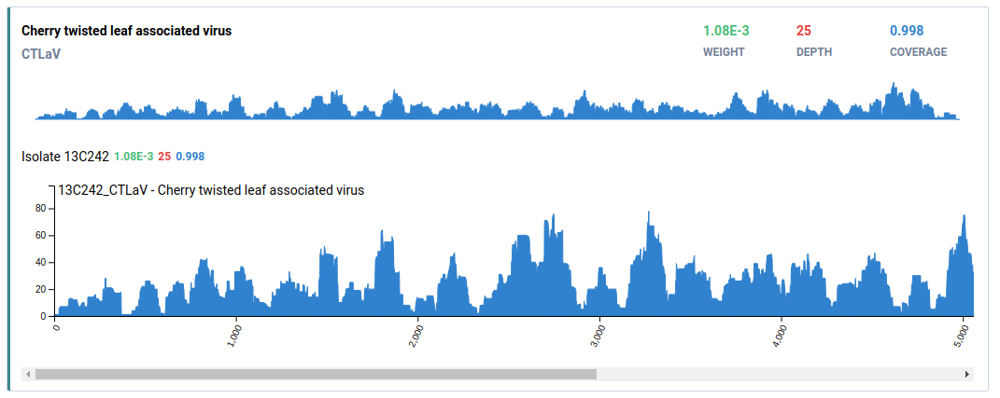

# Virtool

Virtool is a web-based application for diagnosing pathogen infections in using high-throughput sequencing. 
  
Website: https://www.virtool.ca
Gitter: https://gitter.im/virtool



## Getting Started

See the [Virtool documentation](https://www.virtool.ca/docs/manual/start/installation/) to get started with the latest
version of Virtool 4.0.0.

## About Versions

Virtool is currently undergoing a major transformation into a cloud-native application. This will mean Virtool can scale
work across multiple hosts and run natively in Kubernetes and public cloud providers.

For current users and administrators:

1. **Virtool 4.0.0 series should be used for now.**
2. **Virtool 4.0.0 series will continue to receive bug and security fixes for the forseeable future**,
even when Virtool 5.0.0 is released.
3. Virtool 5.0.0 will comprise multiple containerized services that need to run together. A deployment
and migration guide will be provided.

| Version | Build Status | Quality | Test Coverage |
| ------- | ------------ | ------- | ------------- |
| [](https://cloud.drone.io/virtool/virtool) | [](https://www.codacy.com/gh/virtool/virtool?utm_source=github.com&amp;utm_medium=referral&amp;utm_content=virtool/virtool&amp;utm_campaign=Badge_Grade) | [](https://www.codacy.com/gh/virtool/virtool?utm_source=github.com&utm_medium=referral&utm_content=virtool/virtool&utm_campaign=Badge_Coverage) |

## Contributing

### Commits

All commits must follow the [Conventional Commits](https://www.conventionalcommits.org/en/v1.0.0) specification.

These standardized commit messages are used to automatically publish releases using [`semantic-release`](https://semantic-release.gitbook.io/semantic-release)
after commits are merged to `main` from successful PRs.

**Example**

```text
feat: add API support for assigning labels to existing samples
```

Descriptive bodies and footers are required where necessary to describe the impact of the commit. Use bullets where appropriate.

Additional Requirements
1. **Write in the imperative**. For example, _"fix bug"_, not _"fixed bug"_ or _"fixes bug"_.
2. **Don't refer to issues or code reviews**. For example, don't write something like this: _"make style changes requested in review"_.
Instead, _"update styles to improve accessibility"_.
3. **Commits are not your personal journal**. For example, don't write something like this: _"got server running again"_
or _"oops. fixed my code smell"_.

From Tim Pope: [A Note About Git Commit Messages](https://tbaggery.com/2008/04/19/a-note-about-git-commit-messages.html)


